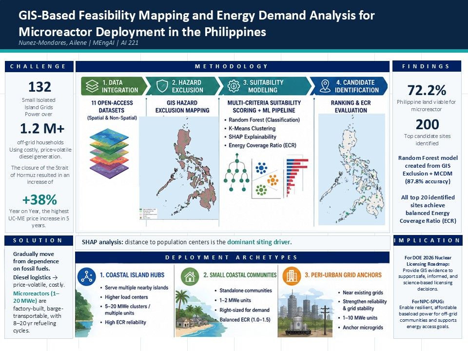

# ⚛️ Microreactor Siting for the Philippines



**A hazard-aware geospatial ML pipeline that turns 15+ national data layers into a ranked shortlist of viable microreactor sites — and explains *why* each one scores the way it does.**


> MEng AI capstone. Where do you put a microreactor in an archipelago of 7,600+ islands, hemmed in by faults, volcanoes, flood plains, and protected habitat — while staying close to the people and infrastructure that justify building it at all? This project answers that as an end-to-end pipeline: from raw national geodata to a defensible, interpretable site ranking.

---

## Why this problem

The Philippines faces a structural energy gap: island grids that are expensive to serve, heavy fuel-import dependence, and a climate mandate to decarbonize. Microreactors — small, factory-built nuclear units — are a candidate answer, but their value lives entirely in *placement*. A site has to thread two competing pressures at once: **stay far from hazard** (seismic, volcanic, flood, landslide, steep terrain, protected land, tsunami-exposed coast) while **staying near demand** (population, ports for modular delivery, roads, water). 

This is fundamentally an energy-systems engineering question — the kind my mechanical/energy-engineering background frames naturally — solved with a geospatial machine-learning toolkit. Siting constraints aren't arbitrary columns; they're physical: thermal load needs water, modular units need port access, and the seismic/volcanic buffers come straight from how these plants actually fail. The pipeline encodes that domain reasoning explicitly rather than letting a model guess at it.

---

## Approach at a glance

The pipeline runs in seven stages, each as a standalone notebook:

| # | Stage | What it does |
|---|-------|--------------|
| 01 | **Data verification** | Load, reproject (→ EPSG:4326), and validate every vector/raster layer against a common 100 m reference grid |
| 02 | **Exclusion mask** | Burn six hard constraints into a single binary "no-go" raster |
| 03 | **Proximity rasters** | Compute distance-to-feature surfaces (population, ports, roads, rivers) |
| 04 | **Suitability scoring** | Weighted multi-criteria index (0–100) over viable land; extract & geolocate top candidates |
| 05 | **Random Forest + SHAP** | Supervised 3-class siting model with interpretable feature attribution |
| 06 | **K-Means archetypes** | Cluster shortlisted sites into deployment tiers |
| 07 | **Maps** | Final cartographic deliverables |

### The exclusion mask (stage 02)

Six constraint layers, each rasterized to the reference grid and OR-combined into one master "unbuildable" mask:

- **Seismic** — 5 km buffer around GEM active faults
- **Volcanic** — tiered buffers from the Smithsonian GVP Holocene volcano list
- **Flood** — Project NOAH 100-year flood zones
- **Landslide** — Project NOAH landslide hazard zones (processed province-by-province for scale)
- **Protected areas** — Key Biodiversity Areas
- **Terrain** — slope > 15° derived from the DEM, plus a tsunami-exposure coastal buffer

### The model (stage 05)

Viable land is labeled into three classes from the suitability index — **Unsuitable / Marginal / Suitable** — a sharply imbalanced target (95.1% / 3.3% / 1.6%). I screened candidate algorithms with a LazyPredict sweep (tree ensembles won), then trained a balanced Random Forest on the seven physical features below, with **SHAP** for per-feature attribution so the ranking is auditable rather than a black box:

`dist_pop` · `dist_port` · `dist_road` · `dist_river` · `pop_density` · `slope` · `elevation`

---

## Results

**Random Forest (held-out test set, balanced sampling):**

| Metric | Score |
|---|---|
| Accuracy | **88.3%** |
| 5-fold CV | **89.1% ± 1.7%** |
| *Suitable* class — precision / recall / F1 | 0.85 / 1.00 / 0.92 |
| Macro F1 | 0.88 |

The confusion matrix shows zero false negatives on the *Suitable* class — the model never discards a genuinely viable site, which is the right error profile for a screening tool (better to over-surface candidates for human review than to silently drop a good one).

**K-Means deployment archetypes (stage 06):** the shortlisted sites cluster cleanly into **three deployment tiers** (k chosen for interpretability, silhouette ≈ 0.41), distinguished by infrastructure proximity and estimated demand — a practical way to match site profiles to deployment strategies across the archipelago.

The top candidates are ranked, deduplicated to a site grid, and joined back to province/region boundaries so the output is an actionable, human-readable shortlist — not just a heatmap.
---

## Data sources

All open data, national or global in coverage:

- **WorldPop** — 100 m population (reference grid)
- **HOTOSM / OpenStreetMap** — sea ports, roads
- **NAMRIA** — administrative boundaries, rivers
- **GEM** — Global Active Faults database
- **Smithsonian GVP** — Holocene Volcano List
- **Project NOAH** — flood (100 yr) and landslide hazard maps
- **Key Biodiversity Areas** — protected-habitat layer
- **DEM** — elevation & derived slope

---

## Repository structure

```
microreactor_siting/
├── notebooks/
│   ├── 01_data_verification.ipynb    # load, reproject, validate layers
│   ├── 02_exclusion_mask.ipynb       # 6-layer hazard exclusion raster
│   ├── 03_proximity_rasters.ipynb    # distance-to-feature surfaces
│   ├── 04_suitability_scoring.ipynb  # weighted multi-criteria index + ranking
│   ├── 05_random_forest.ipynb        # 3-class siting model + SHAP
│   ├── 06_kmeans_clustering.ipynb    # deployment archetypes
│   └── 07_maps.ipynb                 # final cartographic outputs
├── figures/                          # exported maps & model diagnostics
└── NunezMondares_Final.pdf           # full write-up
```

## Tech stack

**Geospatial:** GeoPandas · rasterio · Shapely · GDAL stack
**ML:** scikit-learn (RandomForest, K-Means) · SHAP · LazyPredict
**Core:** Python · NumPy · pandas · matplotlib

---

## Method notes & honest limitations

- **Why a model on top of a scoring index?** The weighted index encodes expert priors; the Random Forest learns the decision boundary those priors imply, and SHAP then checks whether the learned logic is physically sensible. The two cross-validate each other.
- **Class imbalance** (1.6% suitable) is handled by balanced per-class sampling for training; the screening-oriented error profile is intentional.
- **Resolution trade-off:** hazard masking runs at 100 m for fidelity, while scoring/modeling run at ~1 km for tractability across the full national grid.
- **Future work:** uncertainty quantification on the RF probabilities, formal sensitivity analysis on the scoring weights, grid-connection cost as an explicit feature, and an interactive web map for the shortlist.

---

*Capstone for the MEng in Artificial Intelligence (University of the Philippines). Built end-to-end in Python — from raw national geodata to a ranked, explainable siting decision.*
